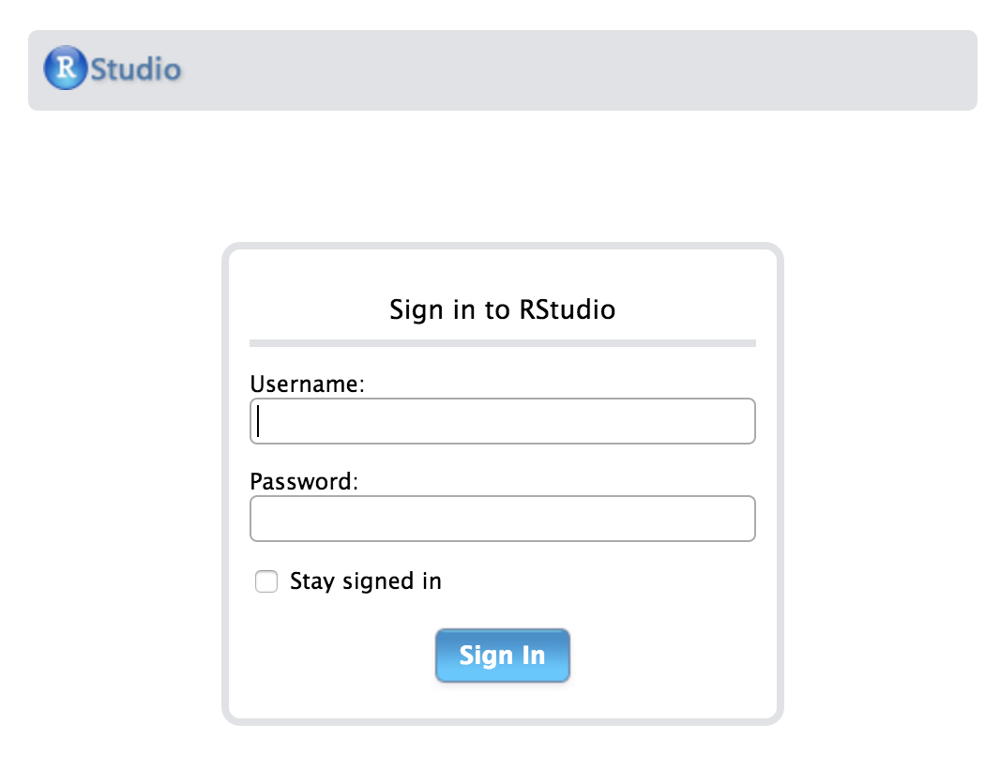

# R and RStudio Basics {#rstudiobasics}

## What is R?

In Chapter \@ref(whyR), I discussed many of the reasons why you should begin doing your analyses (especially those of the data type) using R. If you skipped over that chapter in the hopes of just diving in to learning about R, I suggest you go back and read it over carefully. As you begin building fluency in working with R, it is especially important to review that introductory chapter from time to time.

### R beginnings

R was developed by a group of statisticians who wanted an open-source alternative to the costly proprietary options that were (and still are) popular. Because it was created by statisticians (instead of computer scientists), R has some quirky aspects to it that take some time to get used to. We'll see that many packages have been developed to help with this, and these days, you don't need an advanced degree in statistics to work with R.

Getting back to the development of R... R was created by **R**oss Ihaka and **R**obert Gentleman in New Zealand at the University of Auckland. It is a spin-off of the S programming language and was named partly after the first names of its developers (as you can see from the emphasis above). The beginning ideas for creating R came in 1992, and the first version of R was released in 1994. You can find much more about the background of R, its features, and its connections to the S language on [Wikipedia](https://en.wikipedia.org/wiki/R_(programming_language)).

### R packages

I first learned to use R as a graduate student at Northern Arizona University from [Dr. Philip Turk](http://www.stat.colostate.edu/~pturk/) in 2007. At the time, I never thought that R could have exploded in users as we have seen since 2011. I never would have thought that students taking an introductory statistics course would be encouraged to learn to use R.

In 2007, R was still largely an esoteric and tricky language used by statisticians to do analyses. Getting used to the syntax for producing plots and working with data was especially tricky for those with little to no programming experience. So what has changed since 2007 about learning R?

I believe one of the biggest developments has been the creation of packages to make R easier to work with for newbies. Packages are add-ons created by users of R to increase the functionality of the base R installation. Packages created by Hadley Wickham and others recently have greatly expanded the capabilities of R, while also working to make beginning with R simpler. As of April 2017, [more than 10,400 packages](https://cran.r-project.org/web/packages/index.html) were available on common R repositories.^[You'll see how to download these packages via `install.packages("dplyr")` and load them into your current R working environment via `library("dplyr")`, for example, in Chapter \@ref(rmdanal).]

Another great development is the graphical user interface called RStudio and a package developed by RStudio, Inc. called `rmarkdown`. We will discuss `rmarkdown` (also referred to as R Markdown) in a Chapter \@ref(rmarkdown), and will now focus on discussing RStudio.

## What is RStudio?

RStudio is a powerful, free, open-source integrated development environment for R. Development on RStudio began in 2010, and the first beta was released in February 2011. It is available in two editions: RStudio Desktop and RStudio Server. This book will focus mostly on RStudio Server, but both versions are nearly identical to work with.

Instructions for downloading and installing R and RStudio on Windows and Mac machines are linked below. If you are using RStudio Server, your professor or members of your organization's IT department have done these steps for you. For RStudio Server, you log on using a web browser to an account on the cloud. There are many advantages to using the RStudio Server for beginning users, including sharing of R projects to help with feedback and error resolution. Installation of software can also cause its own headaches, which are eliminated by using the RStudio Server.

**Note for advanced users**:  You can also install your very own RStudio Server for around $5 per month on Digital Ocean. Instructions to do so can be found from Dean Attali [here](http://deanattali.com/2015/05/09/setup-rstudio-shiny-server-digital-ocean/) and on the Digital Ocean site [here](https://www.digitalocean.com/community/tutorials/how-to-set-up-rstudio-on-an-ubuntu-cloud-server).

After you complete a few months of work with the RStudio Server, it is recommended that you download RStudio Desktop to your computer. The instructions to do so are below.

### Installing R and RStudio Desktop

It is worth noting that you can't just install RStudio Desktop without first installing R, as RStudio needs to have R installed to run. Step-by-step guides to installing R and RStudio Desktop with screenshots are available

- [here](http://www.reed.edu/data-at-reed/software/R/r_studio.html) for the Mac, and
- [here](http://www.reed.edu/data-at-reed/software/R/r_studio_pc.html) for a PC.

Unless you plan to create PDF documents (which requires a multiple gigabyte download of LaTeX), you can skip some of the later steps of the installation. It is recommended that you select **HTML** as the Default Output Format for R Markdown. You'll see more about this in Chapter \@ref(rmarkdown).

## Working in RStudio Server

### Logging in and initial screen

The RStudio Server provides a web-based interface to run analyses in R. This means that you will only need an internet connection and a web browser to run your analyses. Your professor or administrator will provide you with a link to the web location of your RStudio Server. After entering the link, you'll see a page that looks something like:

```{r serverlogin, echo=FALSE, fig.cap="Login page for RStudio Server"}

```

After logging in with your username and password, you should see a layout similar to what follows.

```{r initialrstudio, echo=FALSE, fig.cap="Initial page for RStudio Server"}
knitr::include_graphics("screenshots/initial_rstudio.png")
```

For reference, a screenshot of RStudio Desktop looks similar:

```{r initialdesktop, echo=FALSE, fig.cap="Initial page for RStudio Desktop"}
knitr::include_graphics("screenshots/desktop_initial.png")
```

This makes switching between the two RStudio set-ups painless. A discussion of each of the different RStudio panes and their corresponding tabs is in Chapter \@ref(rmarkdown). You'll find that a lot of what follows also applies to RStudio Desktop (except for the Shared Projects feature), but it is always recommended to create an RStudio project regardless of whether you are on the cloud or working locally.

### Basic Workflow with RStudio

When starting a new R project, it is good practice to create a new RStudio project to go along with it. RStudio project files have the extension `.Rproj` and store metadata and information about the R environment you are working in. More information about RStudio projects is available from [RStudio, Inc](https://support.rstudio.com/hc/en-us/articles/200526207-Using-Projects).

If you are sharing homework or lab assignments with your instructor using RStudio Server, for example, it might make sense to create an RStudio project, share it with your instructor, and then create new folders for each lab. We will follow this example below.

The video below shows you how to create a new RStudio project called `initial` and add your first R Markdown file. Note that you also may see a description about what version of R is running on your initial login, as shown in the screencast below in the Console pane.

```{r projrmd, echo=FALSE, fig.cap="Create a new RStudio project and an R Markdown file"}
# gif_link("gifs/proj_rmd.gif")
embed_my_youtube("6YcacPihHuI")
```

We have our **first_rmarkdown.Rmd** file set up.

### Sharing Projects on RStudio Server Pro

You will now see an example of how to share this project with another user. This will enable you and collaborators (other students, your instructor, etc.) to work on the **Rmd** file at the same time. This is similar to working collaboratively on a Google Doc.

RStudio Server is available in multiple formats, so you'll need to make sure you (or your IT administrator) have installed RStudio Server Pro to use the Shared Projects feature. You can find more information on this process from [RStudio, Inc](https://support.rstudio.com/hc/en-us/articles/211659737-Sharing-Projects-in-RStudio-Server-Pro). The video below illustrates the process of sharing the **initial.Rproj** project file we just created with another user on the same installation of RStudio Server.

```{r shareproj, echo=FALSE, fig.cap="Share an RStudio project on RStudio Server Pro"}
#gif_link("gifs/share_proj.gif")
embed_my_youtube("PeL9Du4J6iM")
```

Both myself and `bottk` can now work together on this project. We can type comments and code into  **first_rmarkdown.Rmd** or other files in the project and save files to the common folder where **initial.Rproj** resides.

In Chapter \@ref(rmarkdown), you'll see why it is recommended you work in R Markdown files and you'll also begin to see some examples of how R works with R Markdown.

## RStudio Layout

Initially, you may be a little overwhelmed by all the different panes and tabs that are available in RStudio, but you will soon learn to appreciate this layout. We will begin with the top left pane and proceed clockwise. The layout of these panes can be customized, but it is recommended that beginning users keep the standard layout.

### Code Editor / View Window

The pane in which you will likely spend a majority of your time is the pane on the top left. When you first login, this pane isn't there, but it appeared when we made the **first_rmarkdown.Rmd**. This pane serves as a place to view the contents of files and objects in R. In the screencast below, you can see that we can change the text in this file and then save the file.

Note that, when you edit the file, the tab with the file name changes from black to <font color="red">red</font>, and an asterisk appears after the file name, indicating that the latest changes have not been saved. You should get in the habit of saving files frequently. You can have multiple tabs open and view different files in this pane. In Chapter \@ref(rmarkdown), you'll also see that you can `View` datasets in this pane.

```{r codeeditor, echo=FALSE, fig.cap="Editing an R Markdown file in RStudio"}
#gif_link("gifs/top_left_pane.gif")
embed_my_youtube("fdJROYexFf0")
```

It may not be clear what these additions are really doing just yet. That's ok! When finished, you'll be pressing the **Knit HTML** button near the top of the pane to put all of your text, code, and its output together. We aren't quite there just yet though!

### Environment / History

By default, the top right pane includes an **Environment** tab and a **History** tab. To get a sense of what these tabs provide, we'll need to also use the bottom left pane and the **Console** tab. I'll show you how to create multiple objects in R using the **Console**. Initially, you will see that the **Environment** tab tells us that the "Environment is empty." This means there are no objects (e.g., data) yet. If you click on the **History** tab, you should also see a blank screen with a few icons. We won't go over all of these buttons here, but I encourage you to hover over them and click on them to get a sense for what they do. As I enter code into the **Console**, watch to see how the **Environment** and **History** tabs change.

```{r envhistory, echo=FALSE, fig.cap="Observe the Environment and History tabs based on Console input"}
#gif_link("gifs/env_history.gif")
embed_my_youtube("hfH8DXFovt0")
```

You can think of the **Console** as a place to play around. It is your R sandbox. You can test your code to make sure it is working and then copy that text into your **Rmd** file once you are satisfied with it. We'll see more examples of this in the chapters to come.

Note that, by default, when you enter the name of an object into the console like I did with `sum_1_2` it displays the result. You've also been shown what is called the assignment operator denoted by `<-`. You can read this as putting the contents of the right-hand-side into an object named whatever appears on the left-hand-side. In the example, `num1` is the name of an object that stores the value 7.

A powerful feature of the R language has been introduced in the `sum_1_2 <- sum(num1, num2)` line. `sum` is a function. Functions are denoted by their name and then a parenthesis, followed by one or more arguments separated by commas, and then a closing parenthesis. You'll see many examples of these going forward. Of course, we'll be using R for more than just a basic calculator shown here but this should give you an idea of what the **Environment** and **History** tabs store.

### Console

You'll frequently use the **Console** as a way to check your work or experiment with how to solve a problem using R. Before RStudio, most users of R just had a window like the **Console** provides where they entered their commands and then looked at the results in different windows. We will see that the **Console** and the **Code Editor/View Window** will allow us to store all of our code in a file and then "run" that code through the **Console** to check that it works. The example video below shows how this is done.

```{r consolecode, echo=FALSE, fig.cap="Showing the Console interacting with an R Markdown document R chunk"}
#gif_link("gifs/console_code.gif")
embed_my_youtube("RPF6gGyeJmg")
```

`r noindentbold("Rules for naming objects")`

It is good practice to get in the habit of naming variables corresponding to what they actually represent. If you are dividing two different sums of numbers, you might want to choose a name like `ratio_of_sums` to refer to that object. R has a few restrictions regarding what can be included in the name of R objects:

1. Object names cannot begin with a number.
2. Object names cannot contain symbols used for mathematics or to denote other operations native to R. These symbols include `$`, `@`, `!`, `^`, `+`, `-`, `/`, and `*`.

Another important property of R is that is case-sensitive. You'll see what this means in the video below that also includes examples of invalid names of objects. Note that we will continue to work inside the R chunk as we did in the last video. You'll see that these code chunks provide a nice way to keep track of our important analyses.

```{r nameobjs, echo=FALSE, fig.cap="Invalid object names and case sensitivity in R"}
#gif_link("gifs/naming_objects.gif")
embed_my_youtube("GcWKm13Q1Uc")
```

You may have noticed that R will do some checks and alert you to potential errors by placing a <font color="red">red</font> X to the left of lines of code with common syntax errors. These checks won't catch all errors, but this can be helpful. Note also that `Name`, `name`, and `nAme` refer to three different values.

Another thing to notice is that you can store numbers into an object with a given name like we did earlier with `num1`. If we'd like to store a character string such as "Chester", we can provide the name of the object on the left-hand-side of `<-` and the string in quotation marks on the right-hand-side of `<-`. There are more complex object types that you will see in Chapter \@ref(rmdanal), but it is always important to think about the difference between a number and a character in R.

It's also a good idea to not call objects the names of functions that are built into R. You may want to call the addition of two numbers `sum` and R will allow this, but it is **HIGHLY** recommended that you create more descriptive names and not choose to name objects the same as common R functions. Something like `sum_densities` is better and less likely to be the name of a function.

### The `help` function (`?`)

Of course, you won't know what all of the names of built-in functions are until you practice, but it is something to think about. If you are ever wondering if a function is built-in or is in a package you have included, you can use the `?` function in the **Console** to check. Some examples are shown below as a screencast.

```{r helpfunc, echo=FALSE, fig.cap="Using the ? function to look up help on an R function"}
#gif_link("gifs/help_func.gif")
embed_my_youtube("M1TJrL-ss7A")
```

### The bottom right pane

The bottom right pane in RStudio contains the most tabs by default and is a useful place to view a variety of miscellaneous information about your RStudio project and its files.

`r noindentbold("Files")`

The leftmost tab here shows the file and folder structure for the current working directory. In an RStudio project, this is the folder in which the project file was saved. This shows you where the files are stored, what they are called, and any folders that may exist in your project folder. This can be thought of as similar to going to **My Computer** on a PC or opening **Finder** on a Mac. Similarly, this tab lists the file and directory structure either on the cloud for RStudio Server or on your local machine for RStudio Desktop.

`r noindentbold("Plots / Viewer")`

You'll see clearer examples of what the **Plots** and **Viewer** tabs provide in Chapter \@ref(rmarkdown). As you likely guessed **Plots** will show you the resulting graphs/figures that your R code has generated. The **Viewer** tab can show you the resulting HTML file created from an R Markdown **Knit**.

`r noindentbold("Packages")`

The **Packages** tab lists all packages installed on your computer or cloud server. You can see which packages are loaded in the current working environment by looking to see if a check-mark exists next to the package name. Note that you may not have all of the packages loaded onto your machine that I do below in the video. That's OK. This is just an example of what you may expect.

```{r packagetab, echo=FALSE, fig.cap="Installed packages and whether or not they are loaded currently"}
#gif_link("gifs/package_tab.gif")
embed_my_youtube("Zm54FdyqRsc")
```

You'll also notice a **Description** of the package as well as the **Version** number here. Packages are frequently updated and improved, so this is a way to check whether you have the most up-to-date version of a package. Remember, if you are using RStudio Server, this is likely taken care of for you. If you are using RStudio Desktop, you might find the **Install** and **Update** buttons useful for downloading new packages or updating currently installed ones.

`r noindentbold("Help")`

We also saw an example of using the **Help** tab when we invoked the `?` function. This will show you documentation on R functions, datasets, and packages. When (not if) you come across code and you aren't sure what it does, it is often helpful to enter a question mark followed by the name, and see if the built-in documentation can help you out.
