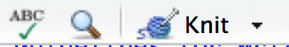

# R Markdown {#rmarkdown}

```{r include=FALSE}
# Not sure why alignment was shifted back to left?
knitr::opts_chunk$set(tidy = FALSE, fig.align = "center")
```

R Markdown provides an easy way to produce rich, fully-documented, reproducible analyses. It allows users to share a single file containing all of the comments, R code, and metadata needed to reproduce the analysis from beginning to end. R Markdown allows you to combine chunks of R code with Markdown text and produce a nicely formatted HTML, PDF, or Word file, without having to know any HTML or LaTeX code or fuss with getting the formatting just right in a Microsoft Word DOCX file.

One R Markdown file can generate a variety of different formats, and all of this is done using a single text file with a few bits of formatting. I think you'll be pleasantly surprised at how easy it is to write an R Markdown document once you get the hang of it.

## Fixing Errors in an R Markdown file {#fixerrors}

Recall the R Markdown file (**first_rmarkdown.Rmd**) that we created in Chapter \@ref(rstudiobasics). We know that we left some errors in the creation of variables there, and while it might seem strange to show you errors, it is good exposure for someone new to R to see a variety of the errors one might see initially. Let's see what happens when we click the **Knit HTML** button with these errors. Then, we will clean up the code and see what the resulting file looks like from the **Knit**.

```{r rmderrors, echo=FALSE, fig.cap="Errors in an R Markdown file"}
#gif_link("gifs/rmd_errors.gif")
embed_my_youtube("UCpPthpvq-0")
```

When you first created this R Markdown file, a basic template was pre-populated with some code and text, to give you a sense of the kinds of things you can include in R Markdown files. We modified some of that code here. For example, I removed all of the lines in the code chunk named `cars` even though the errors did not occur in the declaration of the objects that had names stored in them. We see that an HTML file is produced in the **Viewer** pane, because **View in Pane** was selected.

As you look over the **Including Plots** text, you may be surprised to see that although there was no plot provided in the R Markdown file, the HTML file includes a scatter plot of temperature and pressure. This is because R Markdown evaluates the code stored in R chunks and then includes those results in the HTML (or PDF or DOCX, etc.) output.

You can also see that the text appears as commentary before and after the R code. You'll understand in a bit why the text "Including Plots" is so much larger than the other text.

**Important note**: Remember that all of the R code you want to run needs to be stored in a chunk (in the correct order) for your analysis to be reproducible AND for you not to receive errors when you **Knit**. It is easy to do a lot of work in the R **Console** and then forget to add that work into a chunk in your **Rmd** file. This is probably the number one error you will see when you first begin working in RStudio. An example of this error is shown below.

```{r forgetcode, echo=FALSE, fig.cap="Forgetting to copy from Console to R chunk"}
#gif_link("gifs/forget_copy.gif")
embed_my_youtube("MfXf7OVweVA")
```

The `object not found` errors are the most frequently encountered errors, and along with misspellings and incomplete R code segments, represent the vast majority of issues with R. This is covered in greater detail in Chapter \@ref(errors).

## The Components of an R Markdown File

### YAML

The top part of the file is called the YAML header. YAML is a recursive acronym that stands for "YAML Ain't Markup Language" and is defined on its official website at <http://yaml.org> as:

> YAML is a human friendly data serialization
 standard for all programming languages.

Essentially, the YAML header stores the metadata needed for the document. You can see an example of a YAML header from our **first_rmarkdown.Rmd** file:

```yaml
---
title: "First RMarkdown"
author: "Chester Ismay"
output: html_document
---
```

There are many other fields that can be customized in the YAML header. The important thing to notice here are the three hyphens that begin and end the YAML header. Indentation also has meaning in YAML, so take care when aligning text.

### Headers

```{r headers, echo=FALSE, fig.cap="Headers start with hashtags"}
#gif_link("gifs/headers.gif")
embed_my_youtube("AXfhCJgbpCE")
```

As you can see above, you can create many different sized headers by simply adding one or more `#` in front of the text you'd like to denote the header.

### Emphasis

Whenever you see a hash-tag in the text of your R Markdown document, you now know that this will correspond to bolded, larger text^[Unless you want to have a fourth, fifth, or sixth level header, but these are not common.] that denotes the start of a section of your document.

This is one of the nice features of R Markdown. You can simply look at the plain text and know what it will produce in the knitted document. We can also add different styles of emphasis to words, phrases, or sentences by surrounding them in matching symbols. Below are some examples.

```{r emphasis, echo=FALSE, fig.cap="Different emphasis styles in Markdown"}
#gif_link("gifs/emphasis.gif")
embed_my_youtube("SHVtxehEYsY")
```

You are beginning to see how easy it is to customize your output. We'll next discuss ways to add links to URLs, create ordered and unordered lists, and use other frequently used Markdown features.

### Links

To add a link to a URL, you simply enclose the text you'd like displayed in the resulting HTML file inside `[ ]` and then the link itself inside `( )` right next to each other with no space in between.

```{r links, echo=FALSE, fig.cap="Links to webpages"}
#gif_link("gifs/links.gif")
embed_my_youtube("2GBZgNtKwts")
```

### Lists

The screencast below shows the process of creating both ordered and unordered lists.

```{r lists, echo=FALSE, fig.cap="Ordered and unordered lists"}
#gif_link("gifs/lists.gif")
embed_my_youtube("BlVjGGcYHsk")
```

Note that only numbers are needed as we saw by numbering "Warm up food" with a "1." We can also combine unordered and ordered lists by indenting the text two spaces.

In many of the examples that follow, you will see the actual text you'd type into your R Markdown document highlighted with a gray background and also the results of that text immediately below it.

```markdown
1. Wake up
  - Get out of bed
1. Warm up food
  - Open kitchen door
  - Get plate out of cupboard
2. Make coffee
  i. Warm up water
  ii. Grind beans
3. Make breakfast

  We can have a paragraph (or two) here describing how we could go about making
  breakfast. If we indent the paragraph a few spaces and create a newline, it
  will indent below the item.
```
1. Wake up
    - Get out of bed
1. Warm up food
    - Open kitchen door
    - Get plate out of cupboard
2. Make coffee
    i. Warm up water
    ii. Grind beans
3. Make breakfast

     We can have a paragraph (or two) here describing how we could go about making breakfast. If we indent the paragraph a few spaces it will indent below the item.

### Miscellaneous Markdown

**Line breaks / white spacing**

Line breaks in combination with white space are incredibly important in Markdown, as they frequently denote the start of a new paragraph.

```markdown
Here is an example of text with only a line break.
You may expect this line to appear in a new paragraph but it doesn't.
```

Here is an example of text with only a line break.
You may expect this line to appear in a new paragraph but it doesn't.

In order to start a new paragraph, you need to add white space between the two paragraphs:

```markdown
Here is an example of text with a line break and white space.

You may expect this line to appear in a new paragraph and it does.
```

Here is an example of text with a line break and white space.

You may expect this line to appear in a new paragraph and it does.

**Horizontal rules**

Another useful way to divide up different parts of your document is by including horizontal lines, which can be added by placing three asterisks (or three hyphens) next to each other:

```markdown
***
```

***

```markdown
---
```

---

**Blockquotes**

If you'd like to quote someone or produce an indented text block, you can do so by adding a `>` before the passage:

```markdown
> Reproducible research is the idea that data analyses, and more generally,
scientific claims, are published with their data and software code so that
others may verify the findings and build upon them. - Roger Peng
```
> Reproducible research is the idea that data analyses, and more generally, scientific claims, are published with their data and software code so that others may verify the findings and build upon them. - Roger Peng

**Commenting Text**

There are times where you might want to comment out text inside an R Markdown document. Say you wrote something that you don't really want in the resulting knitted document, but you aren't quite sure if you should delete it completely. To create a comment, enclose the block of text in `<!-- -->` as seen below:

```markdown
<!--
I'd like to save this text for later and don't want to delete it yet.
-->
```

<!--
I'd like to save this text for later and don't want to delete it yet.
-->

You won't see the commented out results here in the book.

`r noindentbold("Equations")`

If you'd like nice mathematical formulas in your document, you can add them between two dollar signs:

```markdown
$y = mx + b$
```

$y = mx + b$

### R Chunks

Now that you have the basics down, we can get to what I believe is the best part about R Markdown: the ability to include R code directly in the document which is compiled in the resulting output. You've seen several examples of R chunks in the R Markdown file already. These code blocks all share several properties in common which you should know:

- Code blocks always begin and end with three backticks ` ``` `.
- After the initial three backticks, the first line of an R chunk begins with `{r`, optionally includes a name and/or other chunk options, and then ends with a `}`.
- The lines enclosed between the beginning and closing three backticks is valid R code that you could execute in the console.

Note that including spaces in front of these backticks will produce an error.

In our **first_rmarkdown.Rmd** file, let's explore an example of recognizing and creating our own R chunks:

```{r rchunks, echo=FALSE, fig.cap="Creating and identifying R chunks"}
#gif_link("gifs/rchunks.gif")
embed_my_youtube("NuMrDN2MpIg")
```

This example introduces you to two different ways to create a vector of values. You'll see further discussion of this in Chapter \@ref(rmdanal). You can see that the code was automatically executed when we pressed the **Knit HTML** button, and its output was included in the knitted file.

**Important note**: Any other R chunks after this one will have access to the three variables created here: `count20`, `count100_by_5`, and `prod`. Any chunks before the `mult_vectors` named chunk **_WILL NOT_** have access to these variables. You can read the document like a book, so it is important to add objects and work with them in the appropriate order. You'll receive errors from R if you don't.

### Inline R code

We've seen that we can add R code and have that run in an R chunk of code enclosed by three backticks. However, what if we wanted to include the results of a simple calculation directly in the text of our document? R Markdown can do that as well:

```{r inliner, echo=FALSE, fig.cap="R code running in the text"}
#gif_link("gifs/inliner.gif")
embed_my_youtube("jhKyLgBqyrY")
```

Another crafty approach is to have the text produced in our document automatically update based on the results of R code. To see an example of this, we will select a number at random from our `count20` vector. If the number is greater than or equal to 10, we will say so. If it isn't, we will report that.

```{r inliner2, echo=FALSE, fig.cap="Update text corresponding to R value"}
#gif_link("gifs/inliner2.gif")
embed_my_youtube("rDCza8Vka6w")
```

You also see that R gave an error when I didn't include the third argument to `ifelse` in quotation marks. However, when I fixed the code and pressed **Knit HTML** again, the error went away.

### Code Highlighting

As you saw in the previous example, it is a good habit to highlight the names of your R objects to differentiate them from regular text. This can be done by enclosing the word in a single backtick such as what we did with `one_value`.

## R Markdown Chunk Options

You can set many options on a chunk by chunk basis. The most common R chunk options are `echo`, `eval`, and `include`. By default, all three of these options are set to `TRUE`.

- `echo` dictates whether the code that produces the result should be printed before the corresponding R output

- `eval` specifies whether the code should be evaluated or just displayed without its output

- `include` specifies whether the code AND its output should be included in the resulting knitted document. If it is set to `FALSE` the code is run, but neither the code or its output are included in the resulting document.

```{r chunkops, echo=FALSE, fig.cap="Common R chunk options"}
#gif_link("gifs/chunkops.gif")
embed_my_youtube("3p4z8cGyocY")
```

Because we specified that `eval=FALSE` and that chunk was where we declared the `one_value` variable, we now obtain an error. You can include multiple chunk options by separating each option with a comma.

```{r chunkops2, echo=FALSE, fig.cap="Common R chunk options - Part 2"}
#gif_link("gifs/chunkops2.gif")
embed_my_youtube("46N738U3q7k")
```


## General Guidelines for Writing R Markdown Files

White space is your friend. You should always include a blank white space between R chunks and your Markdown text. It makes your document much more readable and can reduce some potential errors. Also, leave a line of white space between header text and your paragraphs.

Commentary is always good. Explain yourself and your ideas whenever you can. Remember that your most frequent collaborator is likely yourself a few months down the road. Be nice to future you and explain what you are doing so that you can remember!

Remember that the Console and R Markdown environments (when Knitting) don't interact with each other. This forces you to include only the code in your R chunks that produces exactly the results you want to share with others. Don't inflate your document with extra output. Be concise and clear in exactly what you are doing.

The chunk options can really beautify your documents and customize them exactly to what you'd like the reader of your documents to see. You can find more information on all of the available R chunk options [here](http://yihui.name/knitr/options/).

## Help -> Cheatsheets

RStudio provides really nice cheatsheets that can act as great references to many of the common tasks you will do inside of RStudio. You can get nice PDF versions of the files by going to **Help -> Cheatsheets** inside RStudio.

```{r cheatsheets, echo=FALSE, fig.cap="RStudio Cheatsheets Screenshot"}
gif_link("screenshots/cheatsheets.png")
```

## Spell-check

Near the top of your R Markdown editor window sits one of the more useful tools for writing documents: the spell-check button. It is the green check-mark with "ABC" above it:

`r if(knitr:::is_html_output()) knitr::include_graphics("images/spellcheck.png")`

```{r echo=FALSE, out.width='0.3\\textwidth'}

```

Before you submit a document or share it with someone else, you should spell check your document. You may need to add some R commands to the dictionary or ignore them since those may not be recognized as words, but it is easy to misspell words as we type and this feature can really help.

<!--
**Exercises**

- Create R Markdown files to produce the HTML files in the screenshots below.

-->
