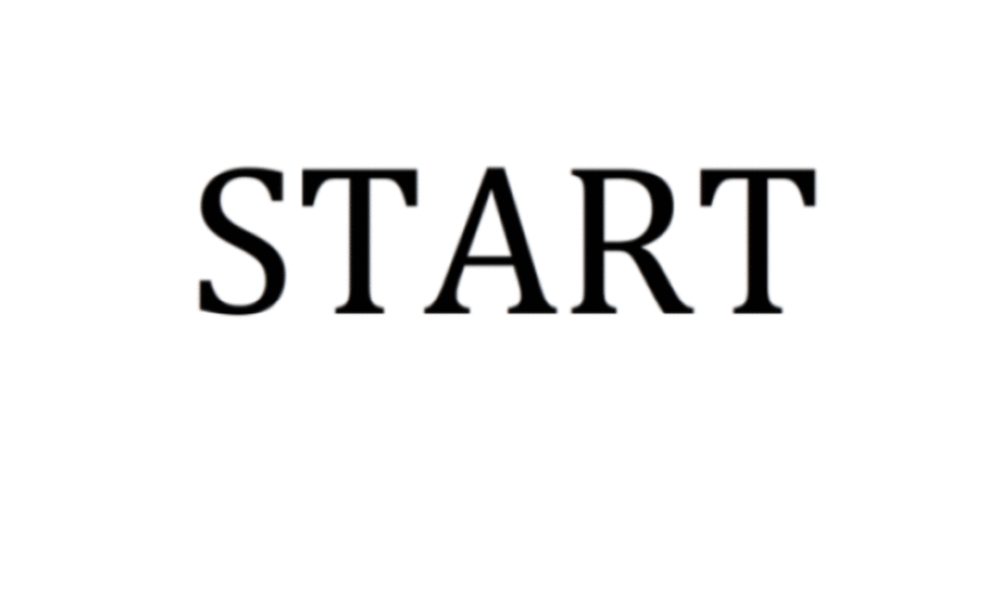

# R Markdown {#rmarkdown}

R Markdown provides an easy way to produce a rich, fully-documented reproducible analysis.  It allows its user to share a single file that contains all of the commentary, R code, and metadata needed to reproduce the analysis from beginning to end.  R Markdown allows for chunks of R code to be included along with Markdown text to produce a nicely formatted HTML, PDF, or Word file without having to know any HTML or $\LaTeX$ code or have to fuss with getting the formatting just right in a Microsoft Word DOCX file.  

One R Markdown file can generate a variety of different formats and all of this is done in a single text file with a few bits of formatting.  I think you'll be pleasantly surprised at how easy it is to write an R Markdown document after your first few encounters. 

## Fixing Errors in an R Markdown file {#fixerrors}

We now shift back to the R Markdown file created in Chapter \@ref(rstudiobasics) called **first_rmarkdown.Rmd**.  We know that we left some errors in the creation of variables there, and while it might seem strange to show you errors, it is good exposure for someone new to this to see what errors one might see initially.  We are going to see what happens when we click the **Knit HTML** button with these errors.  Then we will clean up the code and see what the resulting file looks like from the **Knit**.

```{r rmderrors, echo=FALSE, fig.cap="Errors in an R Markdown file"}
knitr::include_graphics("gifs/rmd_errors.gif")
```

When you initially created an R Markdown file, a basic template with some code and text was inputted for you.  This is to give you a sense of how to create your own R Markdown file with your own R code and your own commentary.  We modified some of that code here.  I decided to remove all of the lines in the `cars` named chunk of code even though the errors did not occur in the declaration of the objects that had names stored in them.  We see that an HTML file is produced in the **Viewer** pane because **View in Pane** was selected.  

As you look over the **Including Plots** text you may be surprised to see that there is no plot provided in the R Markdown file, but in the HTML file there is a scatter-plot showing temperature and pressure varying.  This is something alluded to earlier.  R Markdown runs the code stored in R chunks and then places that output into the HTML (or PDF or DOCX, etc.) format.  

You can also see that the text appears as commentary before and after the R code.  You'll understand in a bit why the text "Including Plots" is so much larger than the other text.

**Important note**: Remember that all of the R code you want to run needs to be stored in a chunk (in the right order) for your analysis to be reproducible AND for you not to receive errors when you **Knit**.  It is easy to do a lot of work in the R **Console** and then forget to add that work into a chunk in your **Rmd** file.  This is probably the number one error you will see when you first begin working in RStudio.  An example of this error is below in a GIF file.

```{r forgetcode, echo=FALSE, fig.cap="Forgetting to copy from Console to R chunk"}
knitr::include_graphics("gifs/forget_copy.gif")
```

The `object not found` errors are the most frequently encountered errors and along with misspellings and not completing R code segments provide the vast majority of issues with R.  You'll see a further breakdown of this in Chapter \@ref(errors).

## The Components of an R Markdown File

### YAML

The top part of the file is called the YAML header.  YAML stands for "YAML Ain't Markup Language" and its website at <http://yaml.org> makes the following statement as to what it is:

> YAML is a human friendly data serialization
  standard for all programming languages.
  
Essentially, the YAML stores the metadata needed for the document.  You can see an example of a YAML header from our **first_rmarkdown.Rmd** file:

```yaml
---
title: "First RMarkdown"
author: "Chester Ismay"
output: html_document
---
```

There are many other fields that can be customized in the YAML header.  The important thing to notice here are the three hyphens that begin and end the YAML header.  Indentation also plays a role with YAML so be careful with your alignment of text.

### Headers

```{r headers, echo=FALSE, fig.cap="Headers start with hashtags"}

```

As you can see above, you can create a lot of different sized headers by simply adding one or more `#` in front of the text you'd like to denote the header.

### Emphasis

Whenever you see a hashtag in the text of your R Markdown document, you now know that this will correspond to bolded larger text^[Unless you want to have a fourth, fifth, or sixth level header, but these are not common.] that denotes the start of a section of your document.  

This is one of the nice features of R Markdown.  You can simply look at the plain text and know what it will produce in the knitted document.  We can also add different styles of emphasis to words, phrases, or sentences by surrounding them in matching symbols.  Below are some examples.

```{r emphasis, echo=FALSE, fig.cap="Different emphasis styles in Markdown"}

```

You are beginning to see how easy it is to customize your output.  We'll next discuss ways to add links to URLs, create ordered and unordered lists, and other frequently used Markdown features.

### Links

To add a link to a URL, you simply enclose the text you'd like displayed in the resulting HTML file inside `[ ]` and then the link itself inside `( )` right next to each other with no space in between.

```{r links, echo=FALSE, fig.cap="Links to webpages"}

```

### Lists

The GIF below shows the process of creating both ordered and unordered lists.

```{r lists, echo=FALSE, fig.cap="Links to webpages"}
knitr::include_graphics("gifs/lists.gif")
```

Note that only numbers are needed as we saw by numbering "Warm up food" with a "1."  We can also combine unordered and ordered lists by indenting the text two spaces.  This text produces the output that immediately follows.

```markdown
1. Wake up
  - Get out of bed
1. Warm up food
  - Open kitchen door
  - Get plate out of cupboard
2. Make coffee
  1. Warm up water
  2. Grind beans
3. Make breakfast

  We can have a paragraph (or two) here describing how we could go about making breakfast.  If we indent the paragraph a few spaces and create a newline, it will indent below the item.
```
1. Wake up
    - Get out of bed
1. Warm up food
    - Open kitchen door
    - Get plate out of cupboard
2. Make coffee
    i. Warm up water
    ii. Grind beans
3. Make breakfast

  We can have a paragraph (or two) here describing how we could go about making breakfast.  If we indent the paragraph a few spaces it will indent below the item.

### Miscellaneous Markdown

- Line breaks

- Horizontal rules

- Blockquotes

- Commenting Text

### R Chunks

### Inline R code

### Code Highlighting

## R Markdown Chunk Options

## General Guidelines for Writing R Markdown Files

White space is your friend.

Commentary is always good.  Explain yourself and your ideas whenever you can.

Remember that the Console and R Markdown environments (when Knitting) don't interact with each other.  This forces you to include the code that produces exactly the results you want to share with others.  Don't 

## Help -> Cheatsheets

<!--
**Exercises**

- Create R Markdown files to produce the HTML files in the screenshots below.

-->

**Last updated:**

```{r time_rmd, echo=FALSE}
paste("By", Sys.info()[["user"]], "on", format(Sys.time(), "%A, %B %d, %Y %X %Z"))
```