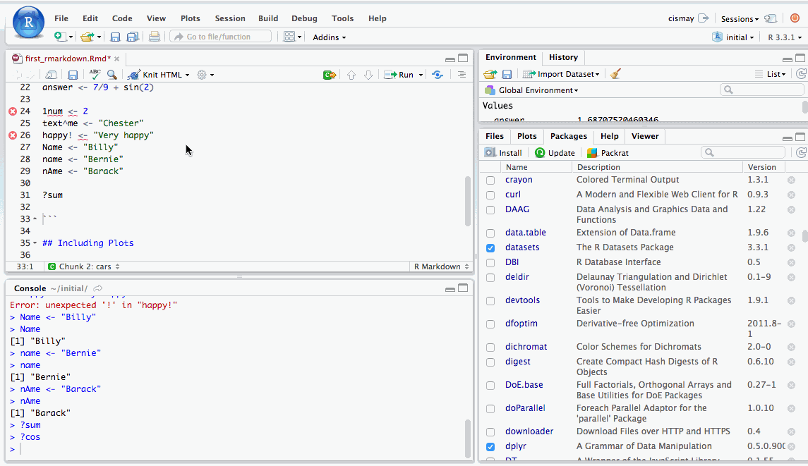

# R Markdown {#rmarkdown}

R Markdown provides an easy way to produce a rich, fully-documented reproducible analysis.  It allows its user to share a single file that contains all of the commentary, R code, and metadata needed to reproduce the analysis from beginning to end.  R Markdown allows for chunks of R code to be included along with Markdown text to produce a nicely formatted HTML, PDF, or Word file without having to know any HTML or $\LaTeX$ code or have to fuss with getting the formatting just right in a Microsoft Word DOCX file.  

One R Markdown file can generate a variety of different formats and all of this is done in a single text file with a few bits of formatting.  I think you'll be pleasantly surprised at how easy it is to write an R Markdown document after your first few encounters. 

## Fixing errors in an R Markdown file

We now shift back to the R Markdown file created in Chapter @\ref(rstudiobasics) called **first_rmarkdown.Rmd**.  We know that we left some errors in the creation of variables there, and while it might seem strange to show you errors, it is good exposure for someone new to this to see what errors one might see initially.  We are going to see what happens when we click the **Knit HTML** button with these errors.  Then we will clean up the code and see what the resulting file looks like from the **Knit**.

```{r rmderrors, echo=FALSE, fig.cap="Errors in an R Markdown file"}

```

When you initially created an R Markdown file, a basic template with some code and text was inputted for you.  This is to give you a sense of how to create your own R Markdown file with your own R code and your own commentary.  We modified some of that code here.  I decided to remove all of the lines in the `cars` named chunk of code even though the errors did not occur in the declaration of the objects that had names stored in them.  We see that an HTML file is produced in the **Viewer** pane because **View in Pane** was selected.  

As you look over the **Including Plots** text you may be surprised to see that there is no plot provided in the R Markdown file, but in the HTML file there is a scatter-plot showing temperature and pressure varying.  This is something alluded to earlier.  R Markdown runs the code stored in R chunks and then places that output into the HTML (or PDF or DOCX, etc.) format.  

You can also see that the text appears as commentary before and after the R code.  You'll understand in a bit why the text "Including Plots" is so much larger than the other text.

**Important note**: Remember that all of the R code you want to run needs to be stored in a chunk (in the right order) for your analysis to be reproducible AND for you not to receive errors when you **Knit**.  It is easy to do a lot of work in the R **Console** and then forget to add that work into a chunk in your **Rmd** file.  This is probably the number one error you will see when you first begin working in RStudio.  An example of this error is below in a GIF file.

```{r forgetcode, echo=FALSE, fig.cap="Forgetting to copy from Console to R chunk"}
knitr::include_graphics("gifs/forget_copy.gif")
```

The `object not found` errors are the most frequently encountered errors and along with misspellings and not completing R code segments provide the vast majority of issues with R.  You'll see a further breakdown of this in Chapter \@ref(errors).

## The Components of an R Markdown File

### YAML

The top part of the file is called the YAML

### Headers

### Lists

### R chunks

### Inline R code

 - Resource for Markdown: https://github.com/adam-p/markdown-here/wiki/Markdown-Cheatsheet

## R Markdown chunk options

## Help -> Cheatsheets


**Last updated:**

```{r time_rmd, echo=FALSE}
paste("By", Sys.info()[["user"]], "on", format(Sys.time(), "%A, %B %d, %Y %X %Z"))
```